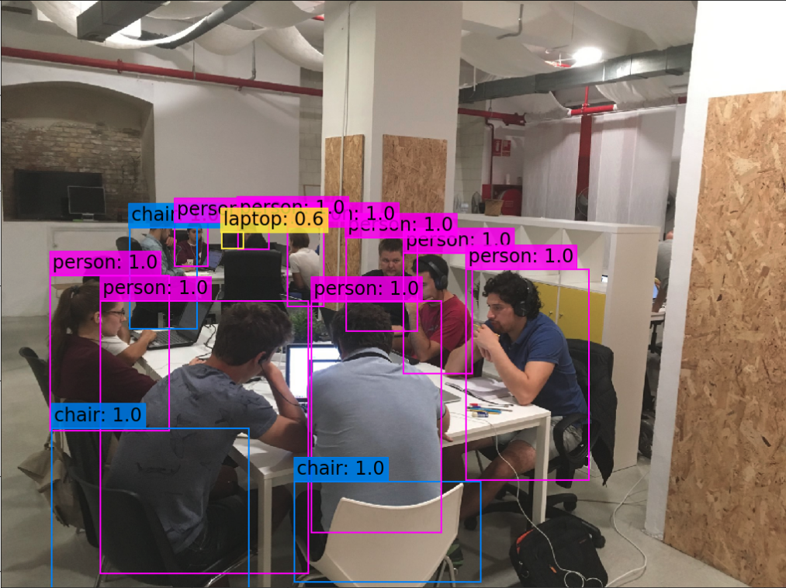
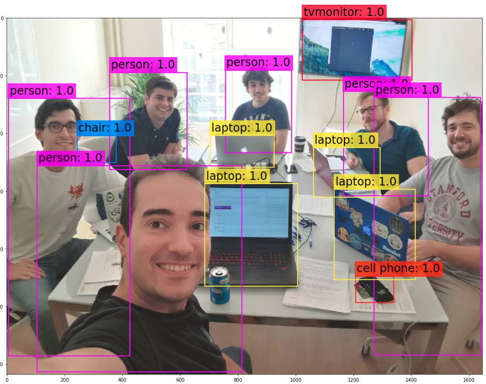

## YOLO (You Only Look Once)
It is a real time object detection algorithm which prioritizes speed and recognition.

YOLO will output  the probabilities of the classes as well as the bounding box parameters (x,y,w,h) where x and y determines the coordinates of the center of the box and w and h are the width and height of the box. It will also return a probability ```pc``` which is the probability of an object existing in the current box of the grid. 

So a basic output of YOLO for a network trained on 3 different classes (c1, c2 and c3) might look li-*ke this ```y = [pc, c1, c2, c3, x, y, w, h]``` where pc, c1, c2 and c3 are probabilities.

In a grid cell the coordinates system is as used in computer vision where x goes left to right (0 to 1) and y goes from the top to the bottom (0 to 1) so if you think of a square the top left corner coordinate will be ```(0,0)``` and the bottom right corner will be ```(1,1)```

The width and height will be a percentage between 0 and 1 this means that if ```w = 0.1``` the width of the bounding box is 10% of the width of the image and the same applies to the heigh if ```h = 0.4``` then the bounding box is 40% of the actual height of the whole image.

### Intersection Over Union (IoU)
 ```IoU = Area of Intersection / Area of Union of both bounding boxes```
 that will give us the area where the 2 boxes overlap. The area of the union is the area of box boxes unified shape.
 
 IoU can only return values from 0 (when the boxes do not overlap at all) and 1 (a perfect match, that is when 2 boxes are overlaping on the whole area) 
 
 ### Non-Maximal Suppression
 Will get rid of overlapping bounding boxes that do not have the maximum probability for object detection ```pc```
once that only the box with the highest ```pc``` is left all other boxes that have a high IoU with the box that is left will also be removed as they are most likely different bounding boxes for the same object.

### Anchor Boxes
If there are multiple objects overlapping we will need to define different size anchor boxes, the given size will determine the shape of the box (aspect ratio) 

That way we will be able to detect overlapping objects with different aspect ratios, this also means that the vector will have more parameters, a set of parameters per anchor box, so for only 1 object we will have the same as we defined before ```y = [pc, c1, c2, c3, x, y, w, h]``` but for 2 anchor boxes we will have the parameters doubled ```y = [pc, c1, c2, c3, x, y, w, h, pc, c1, c2, c3, x, y, w, h]```

 
 Here you can find the [YOLOv3 Paper](https://pjreddie.com/media/files/papers/YOLOv3.pdf) 
 
 
 
 
 
 
